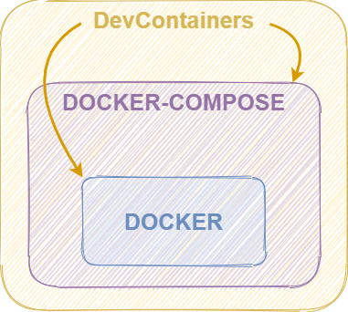
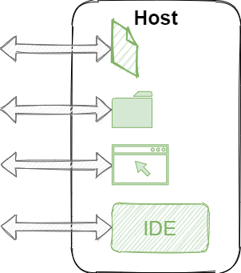

== Environnement de développement conteneurisé

[NOTE.speaker]
--
* Développer dans un conteneur avec tous les outils utiles au développement pré-installés et configurés
* Standardiser les environnements de dévelopement des développeurs
* CDE - déploiement dans le cloud
--

[%auto-animate]
=== DevContainers

[%step]
--
**Spécification** qui formalise la **description** d'un **environnement de __développement__ conteneurisé**.
--

[%step]
--
* https://containers.dev/
* https://github.com/devcontainers/spec
--

[NOTE.speaker]
--
* Initiée par Microsoft depuis 2022
* Uniquement pour le développement (et la CI) mais pas pour la prod
* Microsoft - json (DevFiles - RedHat - yaml)
* Implémentée par de nombreux IDE (VsCode, IntelliJ, ...)
* Implémentation par défaut via une CLI
* Ivan : En fait c'est un docker-compose ?
--

[.columns.is-vcentered]
[%auto-animate]
=== DevContainers vs Docker-Compose

[.column.has-text-right]
[%step]
--

--

[.column.has-text-left]
[%step]
--

--

[NOTE.speaker]
--
* Couche d'abstraction au dessus de Docker pour simplifier la construction et l'exécution du conteneur
* Injection config (git, ssh)
* Installation de fonctionnalités supplémentaires
* Montage auto de volume (sources)
* Build --> create --> start/stop ...
--

[%auto-animate]
=== Mise en oeuvre

[%step]
--
* Un répertoire `.devcontainer`
* Un fichier `devcontainer.json`
--

[%step]
[source%linenums,json]
----
{
	"name": "Spacesuits dev container",
	"image": "node:22"
}
----

[NOTE.speaker]
--
Config minimum
--

=== Features

[source%linenums,json,highlight=4..7]
----
{
	"name": "Spacesuits dev container",
	"image": "node:22",
	"features": {
		"ghcr.io/devcontainers-extra/features/angular-cli:2": {
			"version": "latest"
		}
	}
}
----

[NOTE.speaker]
--
* Script shell exécuté à la construction de l'image
* 1 millier de features disponibles
* Faire ses propres features
--

=== Configuration

[source%linenums,json,highlight=9..10]
----
{
	"name": "Spacesuits dev container",
	"image": "node:22",
	"features": {
		"ghcr.io/devcontainers-extra/features/angular-cli:2": {
			"version": "latest"
		}
	},
	"postCreateCommand": "npm i",
	"forwardPorts": [ 4200 ]
}
----

[NOTE.speaker]
--
* Init : config post création
* Forwarding de port
* Point de montage
* Variables d'environnement
--

=== Personnalisation de l'IDE

[source,json,highlight=3..13]
----
{
	"forwardPorts": [ 4200 ],
	"customizations": {
	  "vscode": {
		"settings": {
		  "editor.tabSize": 2
		},
		"extensions": [
		  "Angular.ng-template",
		  "ms-azuretools.vscode-docker"
		]
	  }
	}
}
----

[NOTE.speaker]
--
* Spécifique a chaque IDE
--

[%auto-animate]
=== Démo

[%auto-animate]
=== Récapitulatif

[.step]
* Simple
* __Features__
* Configuration
* Personnalisation de l'IDE
* __Templates__

[NOTE.speaker]
--
* 100+ templates
* Et si j'ai pas docker ?
* Et si ma machine n'a pas assez de ressources ?
--
