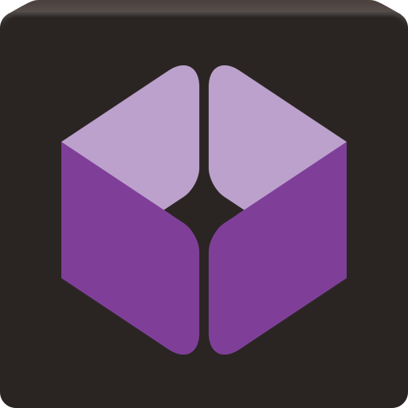
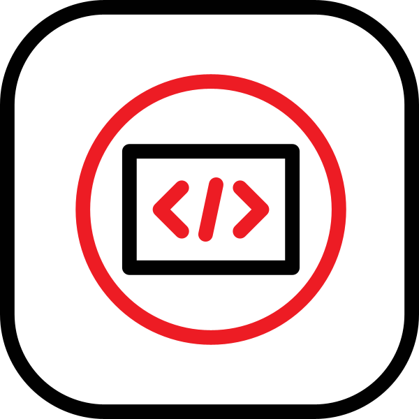
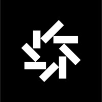
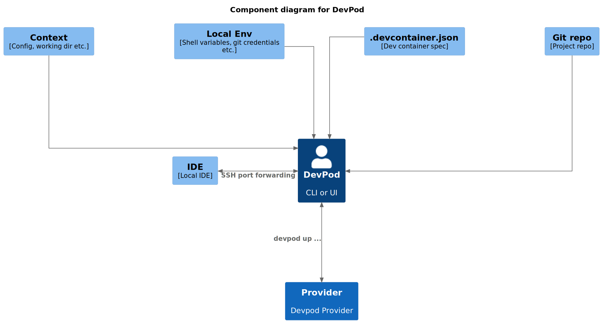
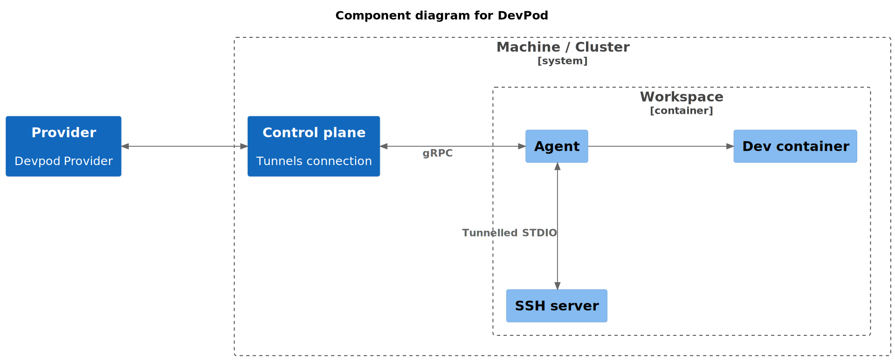
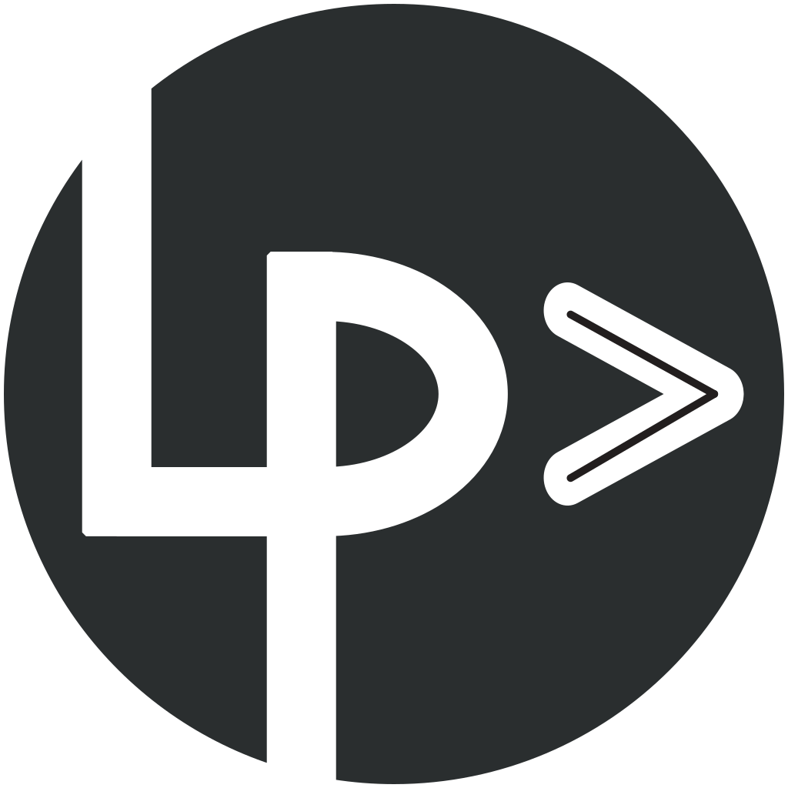
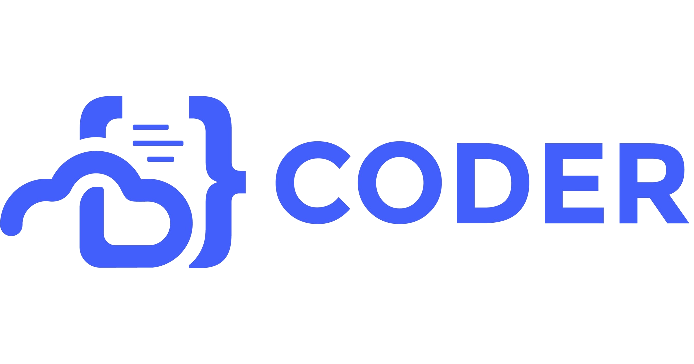
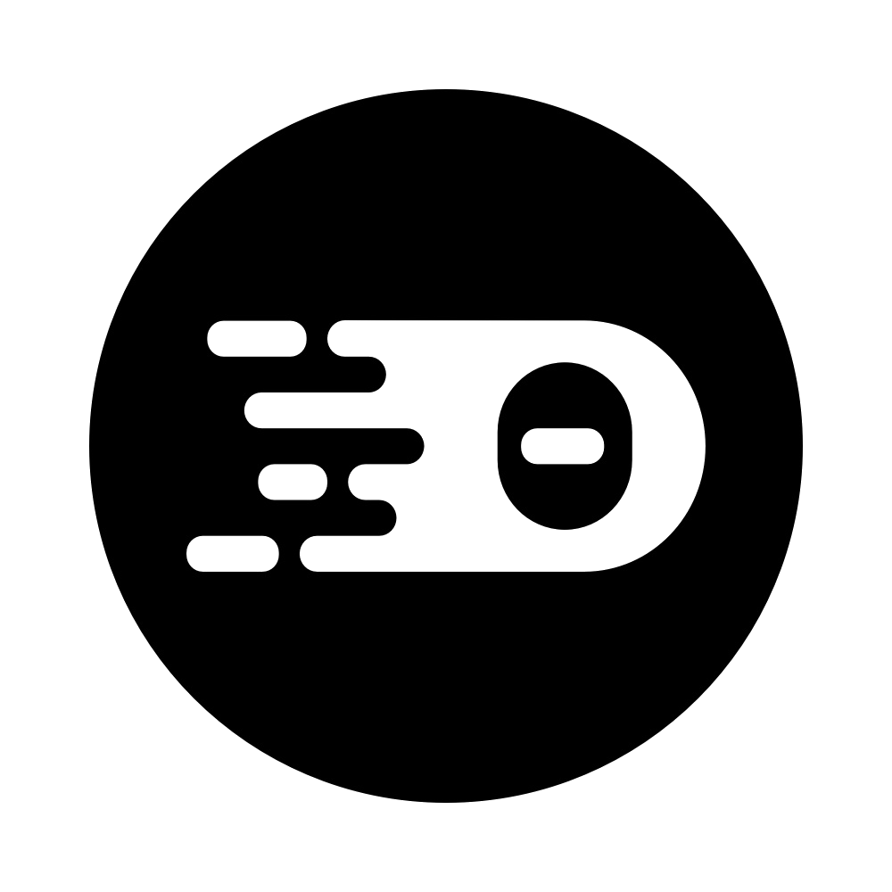
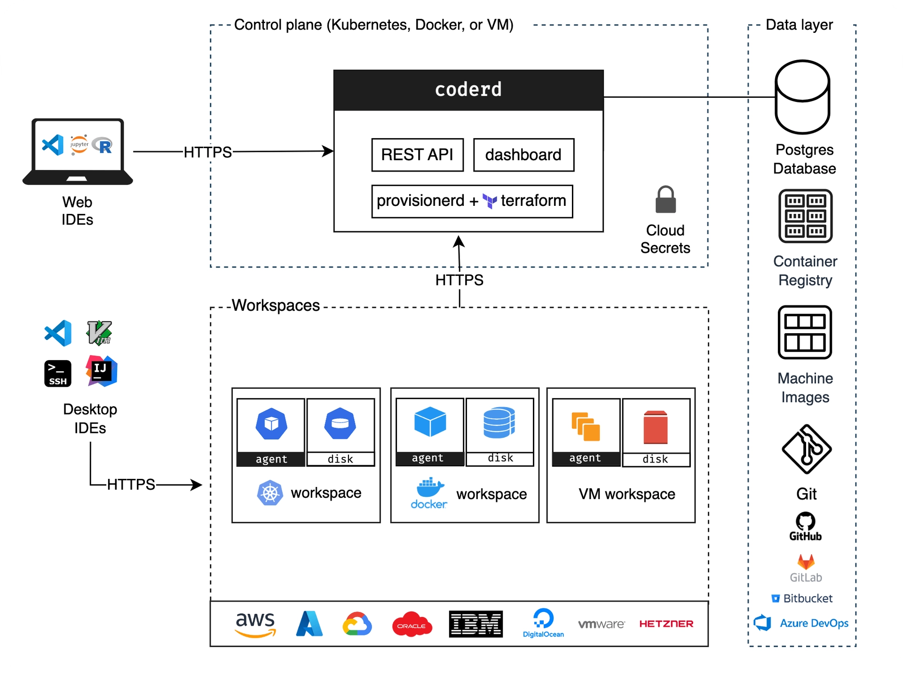

== Cloud Development Environement

[.columns.is-vcentered]
=== Les précurseurs

[.column]
--
image::images/Cloud9IDE.png[width=30%]
Cloud9 (2010)
--

[.column]
--

Codeanywhere (2013)
--

[NOTE.speaker]
--
* Attention Cloud9 est aussi une équipe de esport américaine
* Révolutionnaire à l'époque mais grosse limitation : pas de conteneurisation
--

[.columns]
=== Adoption par les _majors_

[.column.fade-up,step=2]
--
image::images/codespaces.png[width=30%]

Microsoft GitHub codespace
--

[.column.fade-up, step=1]
--

Google Cloud Workstations
--

[.column.fade-up, step=3]
--

RedHat OpenShift Dev Spaces
--

[NOTE.speaker]
--
* Eclipse Che : premier CDE sur Kubernetes, racheté par RedHat en 2019
--

[.columns]
=== Comment ça marche ?

[.column.fade-right, step=1]
--
"A la main" : 

géré par le développeur
--

[.column.fade-left, step=2]
--
A distance : 

géré à travers une web UI
--

[NOTE.speaker]
--
Il existe deux modes de fonctionnement distincts
--

[.columns.is-vcentered]
=== A la main

[.column.fade-right, step=1]
--

Daytona
--

[.column.fade-left, step=2]
--
image::images/devpod-logo.png[width=30%]
DevPod 
--

[NOTE.speaker]
--
* DevPod fonctionne de la même façon que Daytona mais sans paywall
--

[%notitle]
=== devpod 1
[.rounded]

[.smaller]
_https://github.com/loft-sh/devpod/tree/main/docs/uml/c4_machines.puml_

[NOTE.speaker]
--
* Avec un système type devpo, le développeur lance lui-même le CDE
* Il doit fournir le provider, qui peut être l'env local
* La configuration SSH est mise en place par DevPod directement
--

[%notitle]
=== devpod 2
[.rounded]

[.smaller]
_https://github.com/loft-sh/devpod/tree/main/docs/uml/c4_machines.puml_

[NOTE.speaker]
--
* DevPod démarre un serveur ssh chez le provider pour pouvoir router les service sur l'environnement local
--

=== Démo : DevPod

[NOTE.speaker]
--
* Démarer devpod 
* Utiliser le dépôt 
* Démarer le devcontainer sur le kub onepoint
* Expliquer que le backend de l'IDE tourne sur le provider et que le frontend tourne en local
--

[%auto-animate.columns.is-vcentered]
=== A distance

[.column.fade-right, step=2]
--

Gitpod
--
[.column.fade-left, step=1]
--

Lapdev
--

[NOTE.speaker]
--
* La plupart des solutions de sont pas 100% gratuites ou open source, même en self hosted
--

[%auto-animate.columns.is-vcentered]
=== A distance

[.column.fade-right,step=2]
--

coder
--

[.column.fade-left, step=1]
--

Theia Cloud
--

[NOTE.speaker]
--
* Coder est une solution très intéressante car elle peut être totalement self hosted
--

[%notitle]
=== Coder
Architecture de _Coder_
[.rounded]

[.smaller]
_https://coder.com/docs/admin/infrastructure/architecture_

[NOTE.speaker]
--
* Le service *coderd* est chargé de la création des workspaces, pod, etc. et de la connexion des machines entre elles
* Cette infra peut être self-hosted
* Les workspaces on des durées de vie limitées spécifées par l'admin
* Si le workspace n'est pas détruit, les modifs non comitées sont sauvegardée malgré tout
--

=== Démo

[NOTE.speaker]
--
* Exemple avec Github, proche du fonctionnement de coder, 100% Saas
--

