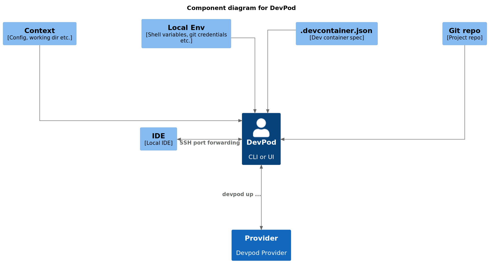
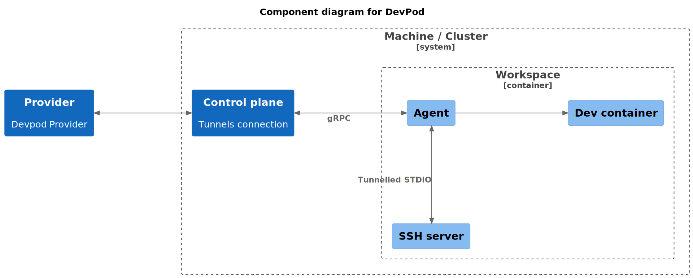
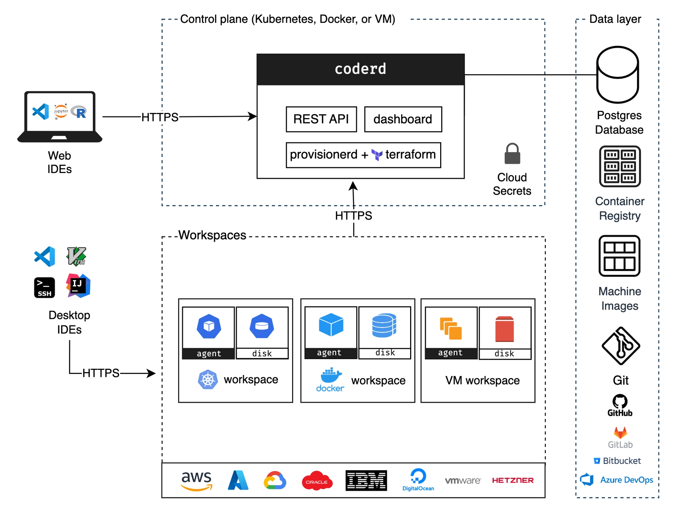

== Cloud Development Environement

=== Historique

[.step]
* Né en 2023 dans le sillage des DevContainers
* Permet de bénéficier des performances du serveur distant (bande passante, ram, cpu...)
* Promesse du "zéro configuration"
* et plus encore..!

[NOTE.speaker]
--
D'autres avantages :

* sécurité renforcée 
* observabilité des machines virtuelles
* économie d'échelle sur les machines
--

=== Adopté par les _majors_

[.step]
* Microsoft codespace
* Google Cloud Workstations
* RedHat OpenShift Dev Spaces

[NOTE.speaker]
--
* Ce sont tous des services managés dans le cloud = cher
* Quelques free tier pour tester 
* 
--

=== Comment ça marche ?

Deux modes :

[.step]
* "à la main" : géré par le développeur
* à distance : géré à travers une web UI

=== A la main : DevPod

[NOTE.speaker]
--
* Fonctionne de la même façon que Daytona mais sans paywall
--

[%notitle]
=== devpod 1

[NOTE.speaker]
--
* Avec un système type devpo, le développeur lance lui-même le CDE
* Il doit fournir le provider, qui peut être l'env local
* La configuration SSH est mise en place par DevPod directement
--

[%notitle]
=== devpod 2

[NOTE.speaker]
--
* DevPod démarre un serveur ssh chez le provider pour pouvoir router les service sur l'environnement local
--

=== Démo

[NOTE.speaker]
--
* Démarer devpod 
* Utiliser le dépôt 
* Démarer le devcontainer sur le kub onepoint
* Expliquer que le backend de l'IDE tourne sur le provider et que le frontend tourne en local
--

=== A distance

Quelques options :

[.step]
* coder (open source)
* Theia Cloud (Eclipse - open source)
* Gitpod
* Lapdev

[NOTE.speaker]
--
* La plupart des solutions de sont pas 100% gratuites ou open source, même en self hosted
--

[%notitle]
=== Coder

Architecture de _Coder_

[NOTE.speaker]
--
* Le service *coderd* est chargé de la création des workspaces, pod, etc. et de la connexion des machines entre elles
* Cette infra peut être self-hosted
--

[%notitle]
=== Codespace

video::images/demo-codespace.webm[size=fill]

[NOTE.speaker]
--
* Exemple avec Github, proche du focntionnement de coder, 100% Saas
--

